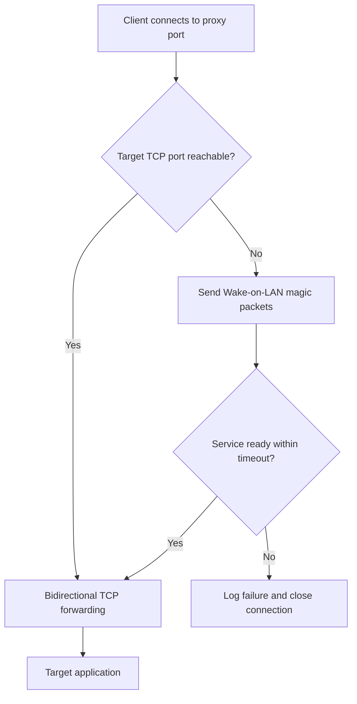
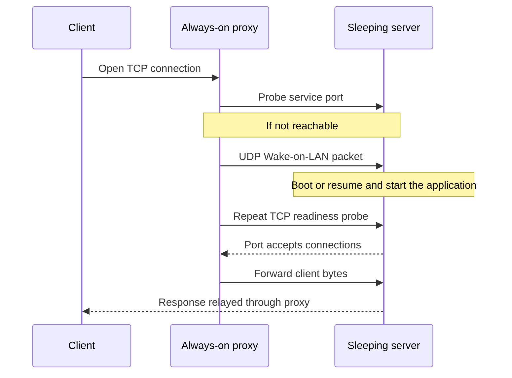

# Wake-on-LAN TCP Proxy

**Connect to a service. Wake its server. Keep your usual client.**


A small, asyncio-based TCP proxy for an always-on machine. If the configured
target service is reachable, it forwards immediately. Otherwise it sends
Wake-on-LAN packets, waits for the service, then forwards the original
connection. Useful for sleeping home servers, development machines, and
on-demand local web services.

No app-specific plugin, account, API key, or third-party Python package is
required. The target must support Wake-on-LAN; this proxy cannot enable it
remotely or wake hardware that does not support it.

## Connection lifecycle





An unreachable service is not proof that the machine is asleep: firewall,
network, or application failures also trigger Wake-on-LAN attempts.

## Requirements

Use an always-on Linux host with Python 3.11+, or Docker Engine with Compose v2.
For the Docker example, host networking is used so UDP broadcasts originate
from the host's network rather than an isolated container network.

On the target, enable Wake-on-LAN in firmware and the operating system, use a
supported network adapter (commonly wired Ethernet), and ensure the desired
application starts after resume/boot. Broadcast packets normally need the
proxy and target to share a LAN; routers/VLANs may block them.

## Install with Docker

```sh
git clone https://github.com/gil906/Wake-On-LAN-TCP-Proxy.git
cd Wake-On-LAN-TCP-Proxy
umask 077
cp .env.example .env
chmod 600 .env
```

Edit `.env` with your own target hostname/IP, MAC address, and service ports.
The supplied `sleeping-server.example` and `02:00:00:00:00:01` are **fictional
placeholders**, not working target settings.

```sh
docker compose up -d --build
docker compose logs --tail 30
```

With the example mapping, connect to `http://127.0.0.1:9000` **only if your
target on port 8080 is an HTTP service**. For another protocol, use its regular
client against the proxy's listen port.

By default the proxy listens only on loopback. To serve trusted LAN clients,
set `WAKE_HOST` to the proxy host's LAN address and configure firewall rules
allowing only those clients. Docker host networking means there is no Compose
port mapping or container-network barrier.

Stop it with `docker compose down`.

## Run Python directly

No dependency installation is needed:

```sh
set -a
. ./.env
set +a
python3 wakeforward.py
```

The commands above are for a POSIX shell. Create and edit `.env` first, as in
the Docker instructions, then run them from the repository directory.

## Configuration

| Variable | Default | Meaning |
|----------|---------|---------|
| `WAKE_MAPPINGS` | Required | Comma-separated `listen_port:target_host:target_port` entries |
| `WOL_MAC` | Required | Comma-separated target MAC addresses |
| `WOL_BROADCASTS` | `255.255.255.255` | Comma-separated broadcast destinations |
| `WAKE_HOST` | `127.0.0.1` | Proxy's local listen address |
| `WAKE_TIMEOUT` | `120` | Seconds to wait for target service readiness |
| `PROBE_TIMEOUT` | `1.5` | Timeout per connection attempt, in seconds |

MAC addresses may use colons, hyphens, or twelve hexadecimal digits. Ports
must be between 1 and 65535. Mapping hosts may be IPv4 addresses or hostnames;
the colon-separated syntax does not support IPv6 literals.

Multiple services on the same sleeping server can share one Wake-on-LAN target:

```dotenv
WAKE_MAPPINGS=9000:sleeping-server.example:8080,9001:sleeping-server.example:8443
WOL_MAC=02:00:00:00:00:01
```

If multiple MACs are supplied, **every wake attempt targets all of them**.
There is no per-mapping MAC selection. Multiple broadcast destinations can
send the same packet on more than one network.

## Behavior and limits

The proxy probes readiness before opening the forwarding connection. Some
applications may log that probe as a connection without an application request.
When unavailable, it retries Wake-on-LAN and readiness approximately every
two seconds, subject to probe duration. Timeouts can include additional
connection/probe overhead.

Clients must tolerate the target's boot time; their own connection/request
timeouts may expire first. TCP half-close is preserved for protocols where a
client sends EOF before reading the response.

There is no requests-per-second/minute cap, connection cap, wake coalescing,
idle connection timeout, HTTP routing, or UDP forwarding. Concurrent clients
can produce repeated wake packets. It does not put machines to sleep or shut
them down, and it cannot report whether a magic packet actually woke hardware.

## Security and privacy

> [!WARNING]
> This is an **unauthenticated TCP forwarder**, not an access-control layer.
> Anyone who can reach a configured proxy port can reach its target service
> and trigger wake attempts. Keep it on loopback or a protected LAN/VPN.

The proxy does not terminate TLS. HTTPS/TLS still requires the target
certificate and hostname to match what the client expects. It does not add
encryption to plaintext protocols.

No personal network addresses, real hardware identifiers, or live configuration
are included in the examples. Your `.env` is excluded from Git and Docker build
context. Operational logs contain configured target addresses; keep them
private. Do not commit your real `.env`, network inventory, logs, or keys.

## Tests

Network tests use local loopback servers and mocked Wake-on-LAN packets; they
do not wake real machines.

```sh
python3 -m unittest -v
```

Or:

```sh
docker compose run --rm \
  -v "$PWD/test_wakeforward.py:/app/test_wakeforward.py:ro" \
  wake-proxy python -m unittest -v
```

## Troubleshooting

| Symptom | Check |
|---------|-------|
| Target never wakes | Firmware/OS Wake-on-LAN, supported adapter, correct MAC, broadcast route |
| Target wakes but connection fails | Target application startup, firewall, target port |
| Client disconnects before forwarding | Increase the client's timeout to cover boot time |
| LAN clients cannot connect | `WAKE_HOST`, proxy firewall, and host-network availability |
| Another service fails to start | Listen-port collision; choose an unused port |
